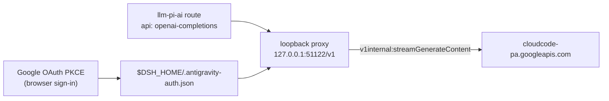

# dsh-subscription-antigravity

Reuse a **Google Antigravity subscription** (Google AI Pro / Ultra) as model
providers in [DeepSeek Harness](https://github.com/shaomingbo/deepseek-harness).
Sign in with your Google account once; the plugin provisions an `antigravity`
model route with Gemini, Claude, and GPT-OSS models from Cloud Code Assist and
serves them to the harness through a loopback OpenAI-compatible proxy.

Protocol shape follows the
[pi-antigravity](https://github.com/Rahularya01/pi-antigravity) reference
implementation. **Unofficial integration** — not affiliated with or endorsed by
Google. Use only with an account and services you are authorized to access.

## Install

```bash
npx --yes github:shaomingbo/dsh-subscription-antigravity#v0.1.0
```

The no-argument installer adds the bundle to the `web` profile (fixed tag
source, `pnpm install --ignore-scripts`, atomic manifest writes, rollback on
dependency-install failure). It never stops or restarts DSH — when it finishes,
**restart DSH manually and hard-refresh the Web GUI**.

Other commands:

```bash
npx --yes github:shaomingbo/dsh-subscription-antigravity#v0.1.0 status
npx --yes github:shaomingbo/dsh-subscription-antigravity#v0.1.0 uninstall
```

Options: `--profile <name>` (default `web`), `--source <spec>`, `--help`.
Environment: `DSH_ANTIGRAVITY_SOURCE` overrides the package source.

### Local development (link:)

```bash
npx --yes github:shaomingbo/dsh-subscription-antigravity#v0.1.0 install \
  --source link:/Users/you/open-source/dsh-subscription-antigravity
```

A `link:` source is for development only; switch back to the fixed tag for
normal use.

### Manual fallback

Edit `~/.dsh/profiles/web/package.json` by hand: add
`"dsh-subscription-antigravity": "github:shaomingbo/dsh-subscription-antigravity#v0.1.0"`
to `dependencies` and `"dsh-subscription-antigravity"` to
`dsh.profile.bundles`, then run `pnpm install --ignore-scripts` in the profile
directory. Restart DSH and hard-refresh afterwards.

## Sign in

1. Open **Settings → Antigravity** in the Web GUI.
2. Choose **Sign in with Google** — a browser tab opens the Google OAuth
   consent screen (PKCE; the local callback server listens only on
   `localhost:51121`).
3. After approval the tab reports success and the section shows your account.
   On a remote/headless browser, paste the callback URL
   (`http://localhost:51121/oauth-callback?…`) into the field provided.

Once signed in, the models below appear in the DSH model picker under the
`antigravity` provider; selecting one makes it the default for new sessions.

Requested Google scopes: `aicode`, `cloud-platform`, `userinfo.email`,
`userinfo.profile`, `cclog`, `experimentsandconfigs`. Review them before
approving.

## Models

Public model ids mirror the Antigravity CLI catalog; each exposes only the
thinking levels the backend advertises (thinking effort maps to the backend's
runtime ids — see `SPEC.md`):

| Model | Input | Thinking |
|---|---|---|
| `gemini-3.7-flash` | text, image | low / medium / high |
| `gemini-3.6-flash` | text, image | low / medium / high |
| `gemini-3.5-flash` | text, image | low / medium / high |
| `gemini-3.1-pro` | text, image | low / high |
| `claude-sonnet-4-6` | text, image | high |
| `claude-opus-4-6` | text, image | high |
| `gpt-oss-120b` | text | medium |

Model availability, entitlement, and quota are account-dependent. Quota is a
shared pool; 429s surface with reset hints. The Settings section shows
best-effort quota usage.

## How it works



- The plugin provisions (and repairs) one route in `llm-pi-ai.providers` via
  the settings service — per-provider merge; your own edits to `models` are
  preserved, and other providers are never touched.
- The proxy binds `127.0.0.1` only and translates OpenAI chat completions
  (streaming SSE and JSON) into Cloud Code Assist envelopes, including tool
  calls, image inputs, thinking → `reasoning_content`, and quota-friendly
  error mapping. Override the port with `DSH_ANTIGRAVITY_PROXY_PORT`.
- Fresh access tokens sync into the ordinary credentials seam
  (`ANTIGRAVITY_ACCESS_TOKEN`) so route resolution always has a value.
- Multi-account rotation, usage-based billing, and non-Google endpoints are
  out of scope.

## Credential safety

- OAuth tokens live only in `$DSH_HOME/.antigravity-auth.json` (0600, atomic
  writes). They are never logged, exported, or sent anywhere except Google's
  OAuth and Cloud Code Assist endpoints. Upstream text in errors is redacted
  and bounded.
- **Uninstall keeps the credential file.** Delete
  `$DSH_HOME/.antigravity-auth.json` yourself for a full wipe.
- The installer only edits the profile `package.json` (dependency + bundle
  entry); it never reads credentials, never runs lifecycle scripts, and never
  stops/restarts DSH.

## Development

```bash
npm install          # test-only tooling; the plugin itself has zero runtime deps
npm run check        # syntax checks + full test suite
npm test
```

The test suite covers the installer contract (temporary `DSH_HOME` installs,
repeats, status, uninstall, malformed manifests, argument errors, rollback),
the OAuth state machine, the translation layer, the loopback proxy against
fakes, route provisioning, credential sync, usage, locale parity, and pack
contents.

## License

MIT — see [LICENSE](LICENSE). Protocol references: [SPEC.md](SPEC.md).
