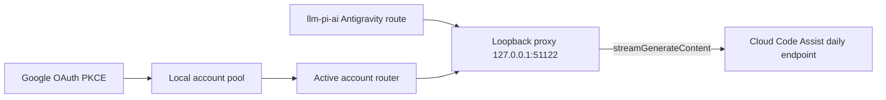

# dsh-subscription-antigravity

Reuse a **Google Antigravity subscription** (Google AI Pro / Ultra) as model
providers in [DeepSeek Harness](https://github.com/shaomingbo/deepseek-harness).
Authorize one or more Google accounts once; the plugin provisions an
`antigravity` model route with Gemini, Claude, and GPT-OSS models from Cloud
Code Assist and serves them through a loopback OpenAI-compatible proxy.

Protocol shape follows the
[pi-antigravity](https://github.com/Rahularya01/pi-antigravity) reference
implementation. **Unofficial integration** — not affiliated with or endorsed by
Google. Use only with an account and services you are authorized to access.

## Install

```bash
npx --yes github:shaomingbo/dsh-subscription-antigravity#v0.2.0
```

The no-argument installer adds the bundle to the `web` profile (fixed tag
source, `pnpm install --ignore-scripts`, atomic manifest writes, rollback on
dependency-install failure). It never stops or restarts DSH — when it finishes,
**restart DSH manually and hard-refresh the Web GUI**.

Other commands:

```bash
npx --yes github:shaomingbo/dsh-subscription-antigravity#v0.2.0 status
npx --yes github:shaomingbo/dsh-subscription-antigravity#v0.2.0 uninstall
```

Options: `--profile <name>` (default `web`), `--source <spec>`, `--help`.
Environment: `DSH_ANTIGRAVITY_SOURCE` overrides the package source.

### Local development (link:)

```bash
npx --yes github:shaomingbo/dsh-subscription-antigravity#v0.2.0 install \
  --source link:/Users/you/open-source/dsh-subscription-antigravity
```

A `link:` source is for development only; switch back to the fixed tag for
normal use.

### Manual fallback

Edit `~/.dsh/profiles/web/package.json` by hand: add
`"dsh-subscription-antigravity": "github:shaomingbo/dsh-subscription-antigravity#v0.2.0"`
to `dependencies` and `"dsh-subscription-antigravity"` to
`dsh.profile.bundles`, then run `pnpm install --ignore-scripts` in the profile
directory. Restart DSH and hard-refresh afterwards.

## Accounts, quota, and switching

1. Open **Settings → Antigravity** and choose **Add Google account**. Google is
   asked to show its account chooser; OAuth uses PKCE and the callback server
   listens only on `localhost:51121`.
2. Repeat to build a local account pool. Each account card shows its email,
   active state, project, lowest known remaining quota, reset time, and an
   expandable runtime-model quota list.
3. Choose **Use this account** to switch immediately without another OAuth
   flow. In-flight requests stay on their original account; new requests use
   the active one.
4. Optional **Automatically switch on exhausted quota** is off by default. When
   enabled it rotates only after an explicit quota-exhausted 429; ordinary rate
   limits, auth errors, network failures, and 5xx responses never trigger it.

A newly added account becomes active. Removing one deletes only that local
credential; removing the active account selects the next saved account. The
single `antigravity` entry in the DSH model picker always uses the active
account. Existing v1 single-account files migrate automatically without a new
sign-in.

For a remote/headless browser, paste the full callback URL
(`http://localhost:51121/oauth-callback?…`) into the field provided. Requested
Google scopes: `aicode`, `cloud-platform`, `userinfo.email`, `userinfo.profile`,
`cclog`, `experimentsandconfigs`; review them before approving.

## Models

Public model ids mirror the Antigravity CLI catalog; each exposes only the
thinking levels the backend advertises (thinking effort maps to the backend's
runtime ids — see `SPEC.md`):

| Model | Input | Thinking |
|---|---|---|
| `gemini-3.7-flash` | text, image | low / medium / high |
| `gemini-3.6-flash` | text, image | low / medium / high |
| `gemini-3.5-flash` | text, image | low / medium / high |
| `gemini-3.1-pro` | text, image | low / high |
| `claude-sonnet-4-6` | text, image | high |
| `claude-opus-4-6` | text, image | high |
| `gpt-oss-120b` | text | medium |

Model availability, entitlement, and quota are account-dependent. Settings
fetches `quotaInfo` separately for every saved account; these are best-effort
runtime-model snapshots, not a promise that different models share one pool.

## How it works



- The plugin provisions (and repairs) one route in `llm-pi-ai.providers` via
  the settings service — per-provider merge; your own edits to `models` are
  preserved, and other providers are never touched.
- The proxy binds `127.0.0.1` only and translates OpenAI chat completions
  (streaming SSE and JSON) into Cloud Code Assist envelopes, including tool
  calls, image inputs, thinking → `reasoning_content`, and quota-friendly
  error mapping. Override the port with `DSH_ANTIGRAVITY_PROXY_PORT`.
- Each generation request snapshots one account's token and project, so a
  manual switch cannot mix identities inside an in-flight request. Optional
  quota failover is serialized to avoid concurrent switch storms.
- The active access token syncs into the ordinary credentials seam
  (`ANTIGRAVITY_ACCESS_TOKEN`); an empty pool removes the seam value.
- Usage-based billing and non-Google endpoints are out of scope.

## Credential safety

- OAuth tokens live only in the versioned account pool at
  `$DSH_HOME/.antigravity-auth.json` (0600, atomic writes). They are never sent
  to the browser RPC, logged, or exported, and go only to Google's OAuth and
  Cloud Code Assist endpoints. Upstream error text is redacted and bounded.
- **Uninstall keeps the credential file.** Delete
  `$DSH_HOME/.antigravity-auth.json` yourself for a full wipe.
- The installer only edits the profile `package.json` (dependency + bundle
  entry); it never reads credentials, never runs lifecycle scripts, and never
  stops/restarts DSH.

## Development

```bash
npm install          # test-only tooling; the plugin itself has zero runtime deps
npm run check        # syntax checks + full test suite
npm test
```

The test suite covers the installer contract (temporary `DSH_HOME` installs,
repeats, status, uninstall, malformed manifests, argument errors, rollback),
v1→v2 credential migration, multi-account OAuth and refresh isolation,
quota-only failover concurrency, the translation layer, loopback proxy, route
provisioning, credential sync, per-account usage, locale parity, and pack
contents.

## License

MIT — see [LICENSE](LICENSE). Protocol references: [SPEC.md](SPEC.md).
