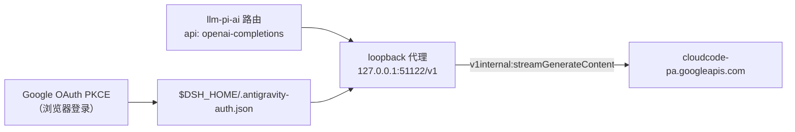

# dsh-subscription-antigravity

在 [DeepSeek Harness](https://github.com/shaomingbo/deepseek-harness) 中复用
**Google Antigravity 订阅**（Google AI Pro / Ultra）：用 Google 账号登录一次，
插件即注册 `antigravity` 模型路由，把 Cloud Code Assist 的 Gemini、Claude、
GPT-OSS 模型通过 loopback OpenAI 兼容代理提供给 harness。

协议实现参考 [pi-antigravity](https://github.com/Rahularya01/pi-antigravity)。
**非官方集成** —— 与 Google 无隶属或背书关系；只在你有权访问的账号和服务上使用。

## 安装

```bash
npx --yes github:shaomingbo/dsh-subscription-antigravity#v0.1.0
```

无参数安装器会把 bundle 加入 `web` profile（固定 tag 来源、
`pnpm install --ignore-scripts`、manifest 临时文件 + 原子重命名、依赖安装失败
自动回滚）。安装器从不停止或重启 DSH —— 结束后请**手动重启 DSH 并强制刷新
Web GUI**。

其他命令：

```bash
npx --yes github:shaomingbo/dsh-subscription-antigravity#v0.1.0 status
npx --yes github:shaomingbo/dsh-subscription-antigravity#v0.1.0 uninstall
```

选项：`--profile <name>`（默认 `web`）、`--source <spec>`、`--help`。
环境变量 `DSH_ANTIGRAVITY_SOURCE` 可覆盖包来源。

### 本地开发（link:）

```bash
npx --yes github:shaomingbo/dsh-subscription-antigravity#v0.1.0 install \
  --source link:/Users/you/open-source/dsh-subscription-antigravity
```

`link:` 仅用于开发；日常使用请切回固定 tag。

### 手动兜底

直接编辑 `~/.dsh/profiles/web/package.json`：在 `dependencies` 加入
`"dsh-subscription-antigravity": "github:shaomingbo/dsh-subscription-antigravity#v0.1.0"`，
在 `dsh.profile.bundles` 加入 `"dsh-subscription-antigravity"`，然后在 profile
目录运行 `pnpm install --ignore-scripts`，重启 DSH 并强刷。

## 登录

1. 打开 Web GUI 的 **Settings → Antigravity**。
2. 点击 **使用 Google 登录** —— 新标签页打开 Google OAuth 授权页（PKCE；本地
   回调服务器只绑定 `localhost:51121`）。
3. 授权后标签页显示成功，设置页出现你的账号。远程/无头浏览器场景，把回调 URL
   （`http://localhost:51121/oauth-callback?…`）粘贴进提供的输入框。

登录后，以下模型会以 `antigravity` provider 出现在 DSH 模型选择器中；选中即
成为新会话的默认模型。

申请的 Google scopes：`aicode`、`cloud-platform`、`userinfo.email`、
`userinfo.profile`、`cclog`、`experimentsandconfigs`。授权前请先审阅。

## 模型

公共模型 id 与 Antigravity CLI 目录一致；每个模型只暴露后端声明的思考级别
（思考级别映射到后端 runtime id，见 `SPEC.md`）：

| 模型 | 输入 | 思考级别 |
|---|---|---|
| `gemini-3.7-flash` | 文本、图片 | low / medium / high |
| `gemini-3.6-flash` | 文本、图片 | low / medium / high |
| `gemini-3.5-flash` | 文本、图片 | low / medium / high |
| `gemini-3.1-pro` | 文本、图片 | low / high |
| `claude-sonnet-4-6` | 文本、图片 | high |
| `claude-opus-4-6` | 文本、图片 | high |
| `gpt-oss-120b` | 文本 | medium |

模型可用性、订阅资格和配额因账号而异。配额是共享池；触发 429 时会附带重置
提示。设置页尽力展示配额用量。

## 工作原理



- 插件通过 settings 服务以「按 provider 合并」的方式供给（并修复）
  `llm-pi-ai.providers` 里的 `antigravity` 路由 —— 你自己改过的 `models`
  会被保留，其他 provider 永远不会被触碰。
- 代理只绑定 `127.0.0.1`，把 OpenAI chat completions（SSE 流式与 JSON）翻译为
  Cloud Code Assist 信封，覆盖工具调用、图片输入、思考 → `reasoning_content`、
  配额友好错误映射。端口可用 `DSH_ANTIGRAVITY_PROXY_PORT` 覆盖。
- 新鲜 access token 会同步进普通凭据 seam（`ANTIGRAVITY_ACCESS_TOKEN`），
  保证路由解析始终有值。
- 多账号轮换、按量计费、非 Google 端点均不在范围内。

## 凭据安全

- OAuth 令牌只存于 `$DSH_HOME/.antigravity-auth.json`（0600、原子写）。除
  Google 的 OAuth 与 Cloud Code Assist 端点外不会发送到任何地方，也不会被
  记录或导出；错误里的上游文本会做脱敏与截断。
- **卸载会保留凭据文件。** 如需彻底清除，请自行删除
  `$DSH_HOME/.antigravity-auth.json`。
- 安装器只修改 profile 的 `package.json`（依赖 + bundle 条目）；从不读取
  凭据、不执行 lifecycle scripts、不停止/重启 DSH。

## 开发

```bash
npm install          # 仅测试工具链；插件本身零运行时依赖
npm run check        # 语法检查 + 完整测试
npm test
```

测试覆盖安装器契约（临时 `DSH_HOME` 的首次安装、重复安装、状态、卸载、畸形
manifest、参数错误、回滚）、OAuth 状态机、翻译层、loopback 代理（fake 上游）、
路由供给、凭据同步、用量、双语键一致性与打包内容。

## 许可

MIT —— 见 [LICENSE](LICENSE)。协议参考：[SPEC.md](SPEC.md)。
